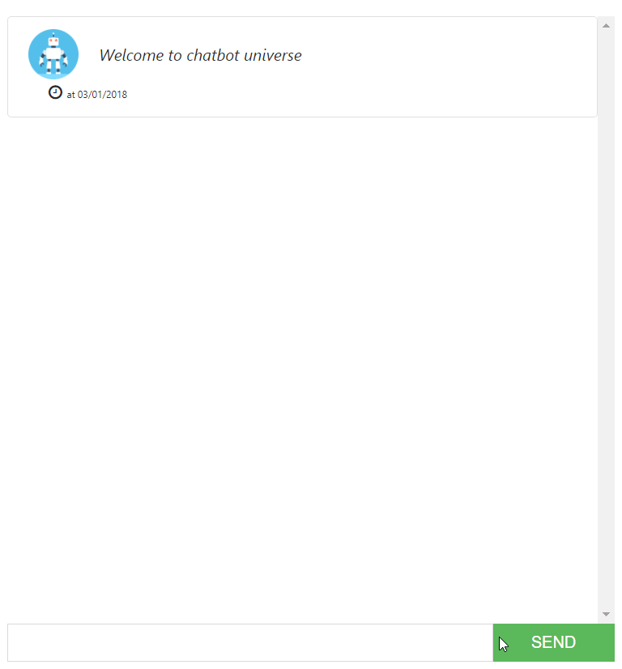

# SmartBot

ChatBot with Angular 5 & DialogFlow [demo](http://smartbot-mlabouardy.s3-website-us-east-1.amazonaws.com)

<p align="center">
  
</p>

## Run

```
ng serve
```

* Make sure to update the environments/environment.ts with your own DialogFlow Client Access Token.

## Further help

[Chatbot with Angular 5 & DialogFlow](http://www.blog.labouardy.com/chatbot-with-angular-5-dialogflow/)
